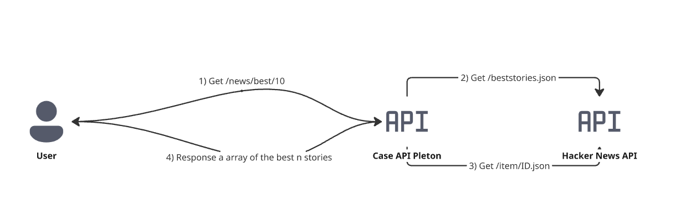

# CasePletonNews — Hacker News Best Stories API


A RESTful API built with **ASP.NET Core 10** that fetches the best stories from the [Hacker News Firebase API](https://github.com/HackerNews/API), returning the top N stories ordered by score (highest to lowest).

---

## Table of Contents

- [Architecture](#architecture)
- [Requirements](#requirements)
- [How to Run](#how-to-run)
- [API Reference](#api-reference)
- [Configuration](#configuration)
- [Future Improvements](#future-improvements)

---

## Architecture

CasePletonNews/     
├── 01 - Api/   
│ └── CasePletonNews.API/   
│ ├── Clients/ # Refit interface (IHackerNewsApi)   
│ ├── DTOs/ # StoryDTO
│ ├── Endpoints/ # Minimal API endpoints    
│ ├── Services/ # Business logic (IHackerNewsService)   
│ └── Settings/ # Strongly-typed config (HackerNewsSettings)    
└── CasePletonNews.AppHost/ # .NET Aspire orchestrator  


**Key decisions:**
- **Refit** — declarative HTTP client, no boilerplate
- **SemaphoreSlim** — throttles concurrent requests to the HN API (max 10 simultaneous)
- **IMemoryCache** — caches each story for 5 minutes, drastically reducing external calls
- **Serilog** — structured logging with console sink
- **ProblemDetails** — RFC 7807 compliant error responses
- **.NET Aspire** — observability and service orchestration out of the box

---

## Requirements

- [.NET 10 SDK](https://dotnet.microsoft.com/)
- Visual Studio 2022+ (optional, for IDE experience)

---

## How to Run

### Option 1 — Visual Studio

1. Open `CasePletonNews.sln`
2. Set `CasePletonNews.AppHost` as the startup project
3. Press `F5` — the Aspire dashboard and the API will start automatically
4. The browser will open Swagger at `https://localhost:7029/swagger`

### Option 2 — Command line

```bash
# Restore and build
dotnet restore
dotnet build

# Run the API directly
dotnet run --project ./01\ -\ Api/CasePletonNews.API/CasePletonNews.API.csproj

# Or run via Aspire (recommended)
dotnet run --project ./CasePletonNews.AppHost/CasePletonNews.AppHost.csproj
```

The API will be available at `https://localhost:7029/swagger`.

---

## API Reference

### GET `/api/v1/stories/best`

Returns the top N Hacker News stories ordered by score (highest to lowest).

**Query parameters:**

| Parameter | Type | Default | Description |
|-----------|------|---------|-------------|
| `limit` | `int` | `50` | Number of stories to return (1–500) |

**Example request:**

```bash
curl "https://localhost:7029/api/v1/stories/best?limit=10"
```

**Example response — 200 OK:**

```json
[
  {
    "id": 12345,
    "title": "Example story",
    "url": "https://example.com/story",
    "score": 400,
    "by": "author",
    "time": 1630000000
  },
  {
    "id": 23456,
    "title": "Another story",
    "url": "https://example.com/another",
    "score": 350,
    "by": "author2",
    "time": 1630000100
  }
]
```

**Error responses:**

| Status | When |
|--------|------|
| `400 Bad Request` | `limit` is out of range (≤ 0 or > 500) |
| `404 Not Found` | No stories returned from HN API |
| `500 Internal Server Error` | HN API unreachable or unexpected failure |

All errors follow the [RFC 7807 ProblemDetails](https://datatracker.ietf.org/doc/html/rfc7807) format:

```json
{
  "title": "Invalid parameter",
  "detail": "Limit must be between 1 and 500.",
  "status": 400
}
```

---

## Configuration

All environment-specific settings live in `appsettings.json`:

```json
{
  "HackerNews": {
    "BaseUrl": "https://hacker-news.firebaseio.com/v0/",
    "TimeoutSeconds": 10,
    "CacheMinutes": 5
  },
  "Serilog": {
    "MinimumLevel": {
      "Default": "Information",
      "Override": {
        "Microsoft": "Warning",
        "System": "Warning"
      }
    }
  }
}
```

---

## Future Improvements

- [ ] Distributed caching with **Redis** for multi-instance deployments
- [ ] Resilience pipeline with **Polly** (retry, circuit breaker)
- [ ] JWT authentication
- [ ] Integration Tests
- [ ] GitHub Actions CI/CD pipeline
- [ ] Docker support

---

## Miro Design

